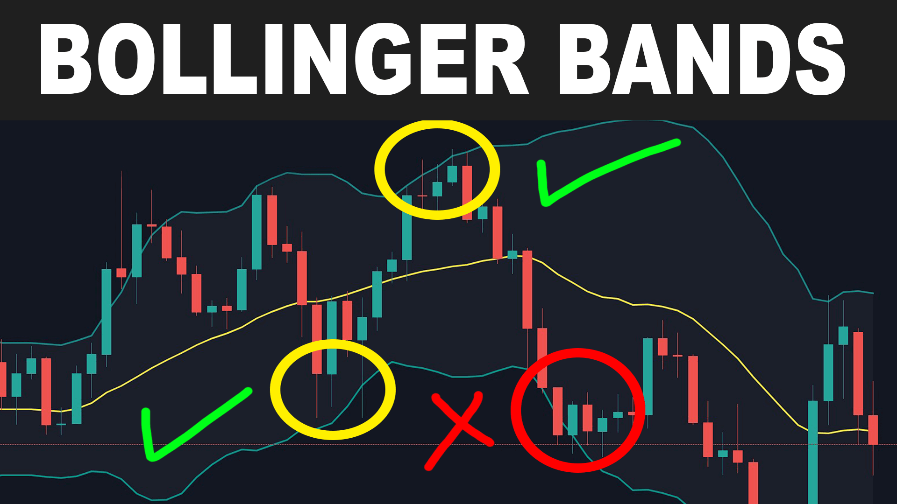
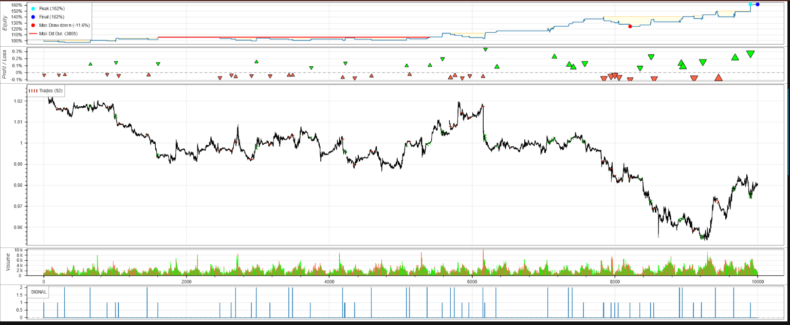

# BackTesting-w-Bollinger-bands
 Backtesting Algorithm w Bollinger bands and EMA

## Intro / Credits
The base for this code session comes from YouTuber CodeTrading.  A link to the video that walks through this code can be found [HERE](https://www.youtube.com/watch?v=IfoZaCGTJ_Q)
The code has been adopted from its original version for my educational purposes.  In no way does use of this code constitute financial advice.  It is an educational tool only.

## Overview
This program uses the Exponential Moving Average and the Bollinger Bands for backtesting.

The EMA will be used to indicate the "trend" if subsequent candles are below the EMA, we have a down trend.  If there are subsequent candles above, we are in up trend.  In down trends we consider short positions and in an up trend we consider long positions.  How many subsequent candles above/below the trend line is left as a tunable variable.

The edges of the Bollinger bands will be used as our entry signals.  In a down trend if the candle closes above the upper Bb this will be our sell/short signal because we assume that the price will revert to the center of the bollinger bands in the negative direction.  In an uptrend if the candle closes below the lower Bollinger band this is our signal to long.

For this program we will use a stop loss defined as:
$$SL = SL_{coef}*ATR$$

$$Take profit = TP = TPSL_{ratio}*SL$$
Both $SL$, and $TPSL_{ratio}$ will be optomized.

### Bollinger Bands
Bollinger bands are a simple calculation used in technical analysis to make assumption about the nature/future of a stock price.  The band is created by addind and subtracting $2*\sigma$ to the Simple Moving Average (SMA).  

$$BOLU=MA(TP,n)+m∗\sigma[TP,n]$$
$$BOLD=MA(TP,n)−m∗\sigma[TP,n]$$

where:

BOLU=Upper Bollinger Band

BOLD=Lower Bollinger Band

MA=Moving average

TP (typical price)=(High+Low+Close)÷3

n=Number of days in smoothing period (typically 20)

m=Number of standard deviations (typically 2)

$\sigma[TP,n]$=Standard Deviation over last n periods of TP

Traders interpret Bollinger bands a signal that a stock is overbought/oversold if the price falls outside of the band range. When intially conceptualized, John Bollinger introduced 22 rules to follow when using the bands.  The details as presented by Investopedia can be found (HERE)[https://www.investopedia.com/articles/technical/102201.asp]. 

### Exponential Moving Average (EMA)
The EMA is a type of moving average that puts greater weight on the most recent data points.  

$$EMA_{today} = (Value_{today} * \frac{Smoothing}{1+Days}) + EMA_{yesterday}*(1-\frac{Smoothing}{1+Days})$$

where:

$EMA = Closing price x multiplier + EMA (previous day) x (1-multiplier)$

$multiplier = \frac{2}{(n +1)}$

n = number of observations

Smoothing = 2, typically

### Relative Strength Index - RSI
The RSI compares the the strength of a security as mesured by its sales and volume for the day.  It is calculated in two parts
$$RSI_{stepone}=100−\frac{100}{[1+\frac{Average loss}{Average gain}]}$$

standard number of periods is 14 days

$$RSI_{steptwo} = 100 - [\frac{100}{1+\frac{(PAG*13)+CG}{((PAL*13)+CL)}$$

where:

PAG - Previous Average Gain

PAL - Previous Average Loss

CG - Current Gain

CL - Current Loss

Typically an RSI > 70 indicates over bought, and RSI < 30 indicates over sold

### Average True Range
The true range indicator is taken as the greatest of the following: current high less the current low; the absolute value of the current high less the previous close; and the absolute value of the current low less the previous close. The ATR is then a moving average, generally using 14 days, of the true ranges. 

## Reference Links
[CodeTrading Youtube](https://www.youtube.com/watch?v=IfoZaCGTJ_Q&t=434s)

[Backtesting.py](https://kernc.github.io/backtesting.py/)

---
# Results
Using an optomizer (basically a gridsearch) of Stop loss coefficients, we calculate the optimal SL and TPSL_ratio coefs to be 1.2, and 2, respectively.  The backtesting algo with these coefs produces a 61.5% return.

